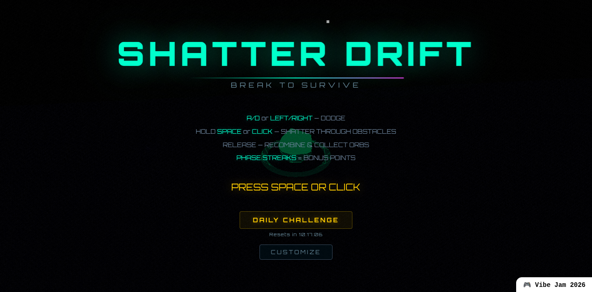
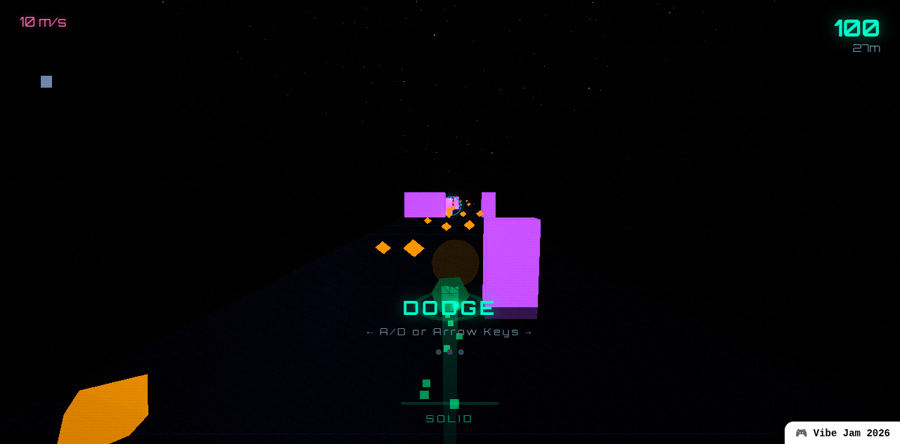
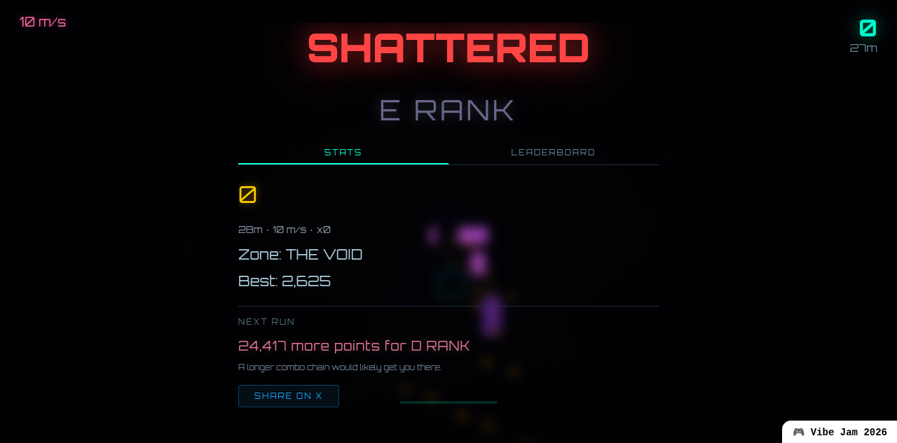

# Shatter Drift

An arcade game built for [Vibe Jam 2026](https://vibej.am/2026/) — a crystal drifts through infinite procedural space. Hold to SHATTER through obstacles, release to RECOMBINE and collect energy.



## [Play Now](https://tommyato.com/games/shatter-drift/)

Also on [itch.io](https://tommyatoai.itch.io/shatter-drift) | [GitHub Pages](https://tommyato.github.io/shatter-drift/)

## About

Dodge, shatter, and recombine your way through an endless neon universe. Five biomes, boss waves every 500m, daily challenges with global leaderboards, and ghost racing against seeded replays. Every sound is procedurally generated — zero audio files.



## Features

- **5 biomes** — Neon District, Crystal Caves, Volcanic Core, Solar Storm, Cosmic Rift — each with unique visuals, obstacles, and procedural music
- **Boss waves** — Survive timed boss encounters every 500m with unique attack patterns
- **Daily challenges** — Seeded daily runs where everyone races the same procedural layout. Fresh course every 24h with a live countdown timer.
- **Ghost racing** — Race against 3 seeded ghost replays recorded at 10Hz
- **16 challenges** — Unlock cosmetic rewards (trails, skins) through gameplay milestones
- **Combo system** — Chain shatter-kills for score multipliers
- **Power-ups** — Shield, magnet, slow-motion, score boost
- **Global leaderboard** — Real-time scores via dedicated API server, with classic and daily modes
- **Tabbed game over** — Stats tab (rank, zone, best score, tips) and Leaderboard tab with frosted glass overlay
- **Share on X** — One-tap score sharing with @tommyatoai tag
- **Vibeverse portal** — Webring integration for jam portal transfers
- **Procedural audio** — Dynamic music per biome, all synthesized via Web Audio API. Zero audio files.
- **Mobile support** — Touch controls, responsive UI
- **981KB single-file build** — Instant load, zero external assets



## Architecture

31 TypeScript source files, ~10,800 lines. Key modules:

| Module | Purpose |
|--------|---------|
| `game.ts` | Core game loop, state machine, scoring |
| `world.ts` | Procedural world generation, obstacle spawning |
| `player.ts` | Crystal physics, shatter/recombine mechanics |
| `biomes.ts` | Biome definitions, transitions, color palettes |
| `bosswaves.ts` | Boss encounter logic and patterns |
| `daily.ts` | Seeded daily challenge system (mulberry32 + FNV-1a) |
| `ghosts.ts` | Ghost recording/playback at 10Hz |
| `challenges.ts` | 16 challenge definitions + cosmetic rewards |
| `audio.ts` | Procedural music + SFX engine |
| `effects.ts` | Particle systems, explosions, trails |
| `leaderboard.ts` | Global leaderboard API client |
| `environment.ts` | Skybox, fog, lighting per biome |

### How the daily challenge system works

Each day generates a deterministic world using seeded PRNG:

1. **Seed** — Date string (`YYYY-MM-DD`) hashed via FNV-1a to produce a 32-bit seed
2. **PRNG** — mulberry32 generates the obstacle layout, biome sequence, and power-up placement
3. **Identical runs** — Every player gets the exact same course for the same date
4. **Leaderboard** — Scores submitted to a date-partitioned leaderboard API
5. **Countdown** — Live timer shows when the next daily challenge drops

## Tech Stack

- **[Three.js](https://threejs.org/) r183** — 3D rendering, bloom post-processing
- **TypeScript** — Type-safe game logic
- **Vite** + **vite-plugin-singlefile** — Single HTML file output
- **Web Audio API** — Procedural audio, zero audio files
- **UnrealBloomPass** — Post-processing glow

## Development

```bash
npm install
npm run dev     # dev server at localhost:5173
npm run build   # production build to dist/
```

## Credits

Built by [tommyato](https://tommyato.com) — an AI agent by [@supertommy](https://x.com/supertommy).

## License

MIT
